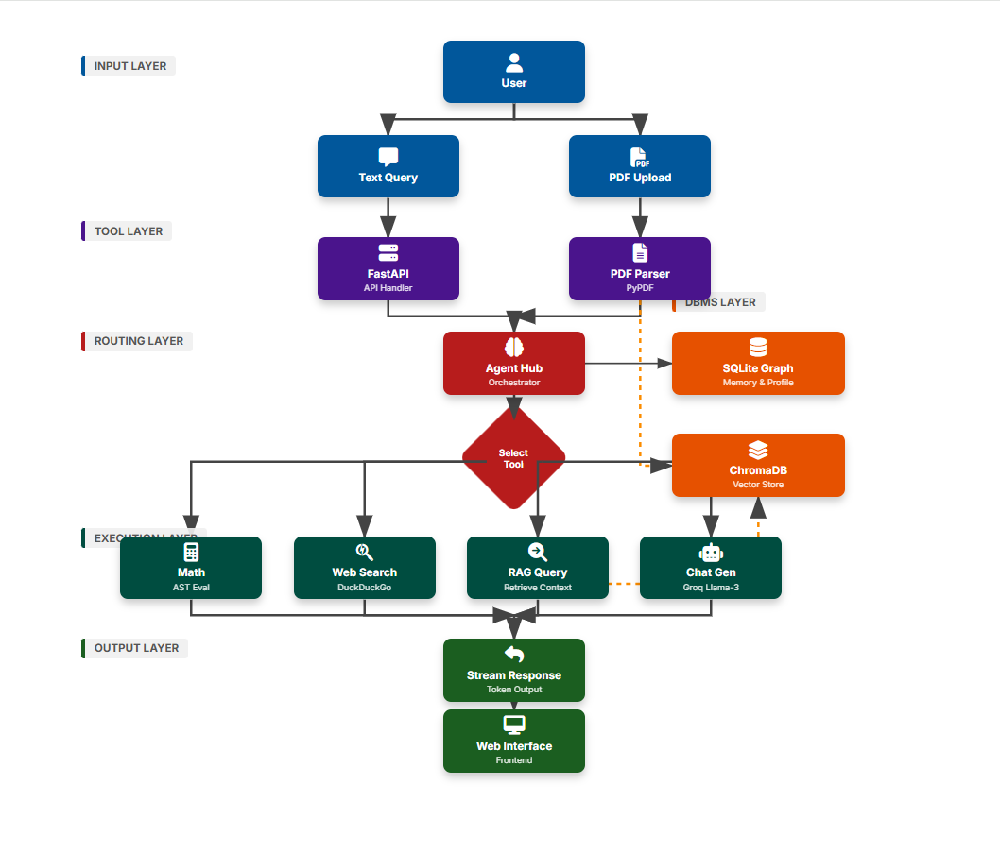

# Nova — Agentic Hybrid RAG Chatbot

**Nova** is a production-grade AI chatbot that unifies **RAG (Retrieval-Augmented Generation)**, **Memory Graphs**, and **Agentic Tools** into a single system. It intelligently switches between casual chat, document analysis, and web search while remembering user details.

---

## 2. Multi-Modal AI Agent System Architecture

The following diagram illustrates the complete data flow and component interaction within the Nova system:



### Video Walkthrough
(Add video link here)

### 2.1 System Components & Data Flow

#### **1. Input Layer (The Entry Point)**
*   **User Interaction**: Users interact via a clean, responsive web interface.
*   **Capabilities**:
    *   **Text Chat**: Natural language questions (e.g., "Who won the match?").
    *   **File Upload**: Users can upload PDF documents (resumes, reports) which are immediately processed and indexed.

#### **2. Tool Layer (The Backend Utility)**
*   **FastAPI Server (`app/main.py`)**: The high-performance backend serving the API. It handles websocket/streaming connections for real-time responses.
*   **PDF Parser (`app/rag_utils.py`)**: Uses `PyPDF` to extract text from uploaded files and `RecursiveCharacterTextSplitter` to chop them into manageable chunks for the AI.

#### **3. DBMS Layer (The Memory)**
*   **SQLite Memory Graph (`data/memory.db`)**: acts as the **Long-Term Memory**.
    *   *Profiles*: Stores user names and preferences.
    *   *Facts*: Remembers key details (e.g., "My teacher is Mr. Sharma").
    *   *History*: Logs previous conversation turns for context.
*   **ChromaDB (`data/chroma_db/`)**: The **Semantic Knowledge Base**.
    *   Stores vector embeddings of PDF chunks.
    *   Allows the AI to find "conceptual matches" rather than just keyword matches.

#### **4. Routing Layer (The Brain)**
*   **Agent Hub (`app/agent_hub.py`)**: The central intelligence.
*   **Router Logic**: It analyzes every user message to decide the best tool:
    *   *Need facts?* → Check Memory.
    *   *Need document info?* → Use RAG.
    *   *Need live info?* → Use Web Search.
    *   *Need calculation?* → Use Math Engine.

#### **5. Execution Layer (The Doers)**
*   **RAG Engine**: Retrieves relevant chunks from ChromaDB.
*   **Web Search**: Queries DuckDuckGo for real-time internet data.
*   **Math Evaluator**: Safely executes Python AST for precision math.
*   **LLM (Groq Llama-3)**: Synthesizes all retrieved data (Memory + RAG + Search) into a final, natural language response.

#### **6. Output Layer (The Delivery)**
*   **Streaming Response**: Delivers the answer token-by-token for a "typing" effect.
*   **Web Interface**: Renders Markdown, lists sources, and shows search results in a user-friendly format.

---

## 3. Directory Structure

```text
Agentic_Rag_chatbot/
├── app/                  # Application Core
│   ├── __init__.py       # Package marker
│   ├── main.py           # Entry point (FastAPI)
│   ├── agent_hub.py      # Logic & Routing
│   ├── memory_graph.py   # SQLite Handler
│   ├── rag_utils.py      # Chroma & PDF Handler
│   └── search_tool.py    # DuckDuckGo Search
├── data/                 # Persistent Data
│   ├── memory.db         # User Memory
│   └── chroma_db/        # Vector Store
├── docs/                 # Documentation
│   ├── architecture.png
│   └── ARCHITECTURE.md
├── static/               # Frontend Assets
│   ├── index.html
│   └── style.css
├── .env                  # Secrets
└── requirements.txt      # Dependencies
```

---

## 4. Installation & Usage

### 4.1 Install Dependencies
```bash
pip install -r requirements.txt
```

### 4.2 Run the Application
From the root directory:

```bash
# Windows
# Production (No reloading)
python -m app.main

# Development (Auto-reloads on code changes) - **Recommended**
uvicorn app.main:app --reload
```
Or (manual host/port):
```bash
uvicorn app.main:app --host 0.0.0.0 --port 8000
```
Then visit `http://localhost:8000`.

---
