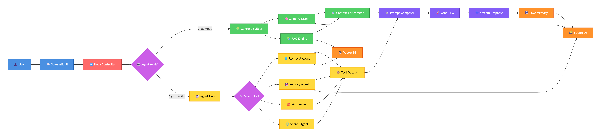
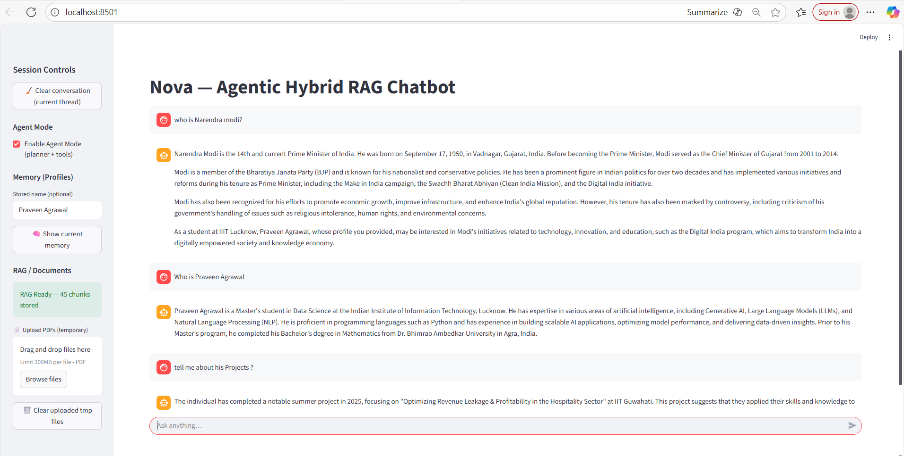
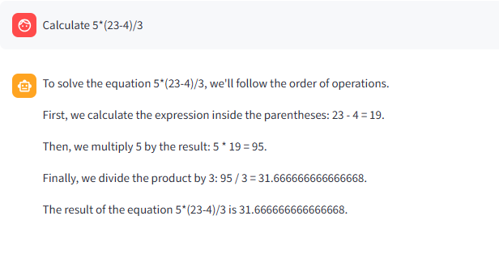

# Nova — Agentic Hybrid RAG Chatbot

Nova is an advanced, production-grade AI chatbot system that combines **Retrieval-Augmented Generation (RAG)**, **Agentic AI**, **Memory Graphs**, **Multi-Agent Tooling**, and **Real‑time Streaming** into a single unified conversational assistant.  
It is built to demonstrate how modern AI systems can intelligently switch between chat-style responses and agent-style tool execution while preserving long‑term memory and handling uploaded documents.

---

## 1. Project Overview

Nova is designed as a complete end‑to‑end intelligent assistant capable of:

- Understanding unstructured natu[text](<../Downloads/README (2).md>)ral language queries.
- Retrieving relevant information from uploaded PDFs using semantic search.
- Saving user profile data and dynamic contextual facts in a persistent SQLite memory graph.
- Automatically deciding whether it should use RAG, memory, math, or search tools.
- Producing high‑quality responses using the Groq LLM with token‑streaming.
- Mixing general knowledge with document‑extracted insights.
- Maintaining a full chat history across sessions.

The system architecture is modular, scalable, and built for production.  
It cleanly separates UI, agent logic, memory, vector search, and LLM processing layers.

---

## 2. Key Features (Detailed)

### 2.1 Hybrid Architecture (Chat Mode + Agent Mode)
Nova dynamically chooses one of two execution pipelines:

#### Chat Mode
Used for general conversations.  
Includes:
- Memory-based personalization
- RAG-based document grounding
- Automatic context enrichment
- Prompt composition

#### Agent Mode
Triggered when:
- Query requires reasoning
- Query requires tools (math, search, memory retrieval, RAG)
- Query looks computational or document-based

Agent mode runs Nova’s **Agent Hub**, a modular agent orchestrator.

---

### 2.2 Intelligent RAG (Retrieval-Augmented Generation)

Nova can:
- Accept PDF uploads
- Chunk documents using `RecursiveCharacterTextSplitter`
- Generate embeddings with `SentenceTransformer`
- Store them inside **ChromaDB (persistent vector DB)**
- Retrieve relevant chunks on demand

Similarity ranking, confidence thresholds, and filtering are built-in.

---

### 2.3 Persistent Memory System (SQLite Graph)

Nova stores:
- User profile attributes (name, profession…)
- Learned facts (friend name, teacher name…)
- All chat messages per session
- Thread‑level persistent history

This enables:
- Long-term personalization
- Multi-turn reasoning
- Context recall even after app restart

---

### 2.4 Multi-Agent System

Nova supports multiple parallel agents:

| Agent | Purpose |
|-------|---------|
| **Retrieval Agent** | Fetches relevant PDF chunks |
| **Memory Agent** | Reads/writes SQLite profile/facts |
| **Math Agent** | Safely evaluates arithmetic using AST |
| **Search Agent** | Uses LangGraph workflow for external info |
| **RAG Engine** | Semantic similarity ranking + chunk extraction |

The system uses a routing mechanism to auto-detect which tool to use.

---

### 2.5 High‑Performance LLM with Streaming

Nova uses the **Groq API ()** for:
- Fast inference
- Streaming tokens directly into UI
- Smooth typing effect in Streamlit

---

### 2.6 Document Intelligence

Users can upload any PDF:
- Résumés
- Research papers
- Reports
- Articles

Nova will:
- Process the document
- Store embeddings
- Retrieve relevant sections
- Ground responses using actual text, reducing hallucination

---

## 3. System Architecture

The system follows a **horizontal pipeline-oriented architecture**:

User → Streamlit UI → Controller → Mode Selector →  
( Chat Mode → Context Builder → Memory Graph + RAG Engine )  
( Agent Mode → Agent Hub → Tool Selector → Specialized Agents ) →  
Prompt Composer → Groq LLM → Response Streamer → SQLite Memory → UI

## 3. System Architecture



---

## 4. Demo Screenshot




---

## 5. Installation Guide (Detailed)

### 5.1 Requirements
- Python 3.8+
- Groq API Key (https://console.groq.com/)
- 500MB of free disk space for vector DB

### 5.2 Clone the Repository
```bash
git clone https://github.com/your-username/nova-chatbot.git
cd nova-chatbot
```

### 5.3 Install Dependencies
```bash
pip install -r requirements.txt
```

### 5.4 Create Environment Variables
Create `.env` file:

```
GROQ_API_KEY=your_groq_api_key
GROQ_MODEL=llama-3.3-70b-versatile
```

### 5.5 Initialize Memory DB
```bash
python -c "from memory_graph import init_db; init_db()"
```

### 5.6 Run the Application
```bash
streamlit run app.py
```

---

## 6. Usage Examples (Detailed)

### 6.1 Conversational Examples
```
Hi, my name is Praveen.
```
Nova will store the name in memory.

```
Tell me about Narendra Modi.
```
General knowledge answer without documents.
```
Pulls data from SQLite memory graph.

---

### 6.2 PDF Document Usage
Upload a résumé PDF, then ask:
```
Summarize my work experience.
```
Nova retrieves actual PDF content and extracts work experience.

```
What are my technical skills?
```
Uses RAG to fetch relevant PDF sections.

---

### 6.3 Mathematical Queries
```
Calculate 5*(23-4)/3

```
---
```
## 4. Demo Screenshot




---
```
Uses secure AST evaluator.

---

## 7. Code Structure (Detailed)

```
nova-chatbot/
│
├── app.py                 # Streamlit UI and main controller
├── agent_hub.py           # Agent engine + tool routing + streaming
├── rag_utils.py           # PDF loader, embedding engine, vector search
├── memory_graph.py        # Persistent memory (SQLite)
├── graph_agent.py         # LangGraph-based search agent
├── search_tool.py         # External information retrieval
├── memory_utils.py        # Utility memory read/write helpers
├── requirements.txt       # Dependencies
├── Architecture.png       # Architecture diagram
├── NOVA_demo.png          # Demo screenshot
└── tmp_uploads/           # Temporary PDF storage
```

---

## 8. Configuration Options

### RAG Settings
Edit in `rag_utils.py`:
- `chunk_size`
- `chunk_overlap`
- `similarity_threshold`

### LLM Model Selection
Modify `.env`:
```
GROQ_MODEL=llama-3.3-70b
```

### Memory Storage
Custom schema changes can be made in:
```
memory_graph.py
```

---

## 9. Contributing
1. Fork the repo  
2. Create a branch  
3. Submit pull request  
4. Describe feature clearly


---

## 10. Acknowledgments
- Groq LLM  
- LangChain  
- LangGraph  
- ChromaDB  
- SentenceTransformers  
- Streamlit  

---

